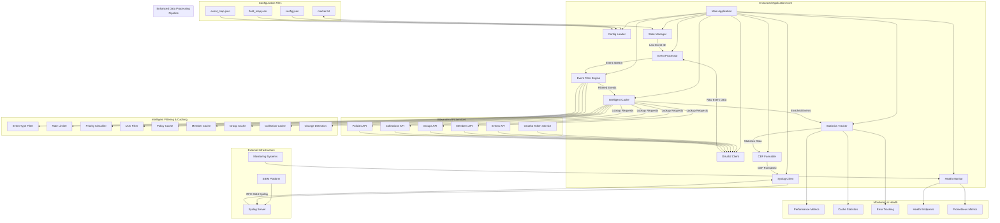
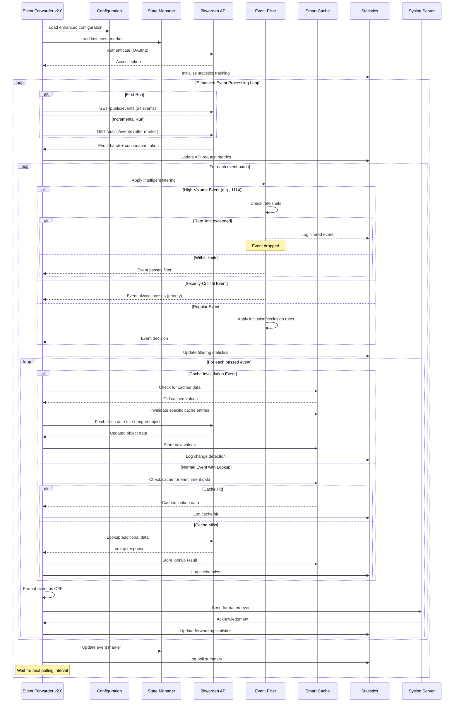

# Hekate - Enhanced Bitwarden API to Syslog Forwarder

A standalone Go application that polls the Bitwarden Organization API for events and forwards them to a syslog server in CEF (Common Event Format) with **intelligent filtering**, **comprehensive statistics**, **change detection**, and **enhanced audit trails** for SIEM ingestion and security monitoring.

## Overview

This application provides real-time event forwarding from Bitwarden Organizations to your SIEM or log analysis platform. It features intelligent event filtering to reduce noise, comprehensive statistics tracking, smart lookup caching with automatic invalidation, and converts all data to industry-standard CEF format with enhanced audit capabilities.

### Key Features

- **🚫 Intelligent Event Filtering** - Eliminates noise from high-volume events (autofill, views, etc.)
- **📊 Comprehensive Statistics** - Detailed performance metrics and operational visibility
- **🔄 Smart Cache Management** - Automatic cache invalidation based on event types
- **🔍 Change Detection** - Before/after value tracking for policy, member, group, and collection changes
- **⚡ Rate Limiting** - Configurable rate limits for noisy event types
- **🎯 Priority Events** - Always include security-critical events regardless of filters
- **🔐 OAuth2 Authentication** - Secure client credentials flow for API access
- **📈 Real-time Monitoring** - Health endpoints and Prometheus-compatible metrics
- **🛡️ Production Ready** - Comprehensive error handling, retry logic, and graceful degradation
- **📋 CEF Format** - Industry-standard Common Event Format output with enrichment
- **🧪 Built-in Testing** - Pre-flight validation of all connections and configurations

## Installation & Usage

### Prerequisites

- Go 1.18 or later
- Bitwarden Organization API credentials (Client ID and Secret)
- Network access to syslog server
- Appropriate Bitwarden API permissions (`api.organization` scope)

### Building

```bash
go build -o bw-events bw-events.go
```

### Quick Start

```bash
# Test configuration and connections
./bw-events --test --client-id "your-client-id" --client-secret "your-secret"

# Run with minimum required parameters
./bw-events --client-id "your-client-id" --client-secret "your-secret" --syslog-server "10.1.1.100"

# Run with configuration file
./bw-events --config /etc/bitwarden/config.json

# Validate configuration only
./bw-events --validate --config /etc/bitwarden/config.json
```

### Advanced Usage

```bash
# Enable verbose logging with detailed statistics
./bw-events --verbose --client-id "your-id" --client-secret "your-secret"

# Custom field mapping and filtering
./bw-events --field-map custom_field_map.json --event-map custom_event_map.json

# Health monitoring on custom port
./bw-events --health-port 9090

# Show version and capabilities
./bw-events --version
```

## Command Line Arguments

| Argument | Description | Default |
|----------|-------------|---------|
| `--help` | Show comprehensive help message | |
| `--version` | Show version and build information | |
| `--test` | Test all connections and dependencies | |
| `--validate` | Validate configuration and exit | |
| `--config FILE` | Load configuration from JSON file | |
| `--client-id ID` | Bitwarden API Client ID (**required**) | |
| `--client-secret SECRET` | Bitwarden API Client Secret (**required**) | |
| `--api-url URL` | Bitwarden API base URL | `https://api.bitwarden.com` |
| `--identity-url URL` | Bitwarden Identity URL | `https://identity.bitwarden.com` |
| `--syslog-server HOST` | Syslog server address | `localhost` |
| `--syslog-port PORT` | Syslog server port | `514` |
| `--syslog-proto PROTO` | Syslog protocol: tcp/udp | `tcp` |
| `--interval SECONDS` | Event fetch interval | `60` |
| `--conn-timeout SECONDS` | Connection timeout | `30` |
| `--max-retries NUM` | Maximum retry attempts | `3` |
| `--retry-delay SECONDS` | Retry delay | `5` |
| `--max-backoff SECONDS` | Maximum backoff delay | `300` |
| `--log-level LEVEL` | Log level: debug/info/warn/error | `info` |
| `--log-file FILE` | Log file path | stdout |
| `--field-map FILE` | Field mapping configuration file | `bitwarden_field_map.json` |
| `--event-map FILE` | Event type mapping file | `bitwarden_event_map.json` |
| `--marker-file FILE` | Event marker file for state tracking | `bitwarden_marker.txt` |
| `--health-port PORT` | Health check HTTP server port (0 to disable) | `8080` |
| `--max-msg-size SIZE` | Maximum syslog message size | `8192` |
| `--verbose` | Enable verbose output | `false` |

## Configuration

### Complete config.json Example

```json
{
  "bitwarden_api": {
    "api_base_url": "https://api.bitwarden.com",
    "identity_url": "https://identity.bitwarden.com",
    "client_id": "your_client_id_from_bitwarden_portal",
    "client_secret": "your_client_secret_from_bitwarden_portal"
  },
  "syslog": {
    "server": "your.syslog.server.com",
    "port": "514",
    "protocol": "tcp"
  },
  "polling": {
    "fetch_interval": 60,
    "connection_timeout": 30,
    "max_retries": 3,
    "retry_delay": 5,
    "max_backoff_delay": 300
  },
  "logging": {
    "log_level": "info",
    "log_file": "/var/log/bitwarden-events.log",
    "verbose": false
  },
  "files": {
    "marker_file": "/var/lib/bitwarden/marker.txt",
    "field_map_file": "/etc/bitwarden/bitwarden_field_map.json",
    "event_map_file": "/etc/bitwarden/bitwarden_event_map.json"
  },
  "monitoring": {
    "health_check_port": 8080,
    "enable_metrics": true
  }
}
```

### Enhanced Field Mapping (bitwarden_field_map.json)

```json
{
  "event_filtering": {
    "mode": "exclude",
    "excluded_events": [
      "1114", "1107", "1108", "1109", "1110", 
      "1111", "1112", "1113", "1117"
    ],
    "rate_limiting": {
      "1114": {"max_per_hour": 10, "enabled": true},
      "1107": {"max_per_hour": 50, "enabled": true},
      "1111": {"max_per_hour": 20, "enabled": true}
    },
    "priority_events": [
      "1000", "1001", "1002", "1005", "1006",
      "1500", "1501", "1502", "1503", "1700", "1600"
    ],
    "user_filtering": {
      "exclude_service_accounts": true,
      "exclude_users": [],
      "include_only_users": []
    }
  },
  "statistics": {
    "enable_detailed_logging": true,
    "log_interval_events": 100,
    "track_cache_metrics": true,
    "track_performance_metrics": true
  },
  "lookups": {
    "memberId": {
      "endpoint": "/public/members/{id}",
      "response_mapping": {
        "name": "memberName",
        "email": "memberEmail",
        "status": "memberStatus",
        "twoFactorEnabled": "member2FA"
      }
    }
  }
}
```

## Environment Variables

All configuration options can be set via environment variables:

| Environment Variable | Description |
|---------------------|-------------|
| `BW_API_URL` | Bitwarden API base URL |
| `BW_IDENTITY_URL` | Bitwarden Identity URL |
| `BW_CLIENT_ID` | **API Client ID (required)** |
| `BW_CLIENT_SECRET` | **API Client Secret (required)** |
| `SYSLOG_PROTOCOL` | Syslog protocol (tcp/udp) |
| `SYSLOG_SERVER` | Syslog server address |
| `SYSLOG_PORT` | Syslog server port |
| `FETCH_INTERVAL` | Event fetch interval in seconds |
| `LOG_LEVEL` | Log level |
| `LOG_FILE` | Log file path |
| `CONNECTION_TIMEOUT` | Connection timeout in seconds |
| `MARKER_FILE` | Event marker file path |
| `FIELD_MAP_FILE` | Field mapping configuration file |
| `EVENT_MAP_FILE` | Event type mapping file |
| `HEALTH_CHECK_PORT` | Health check server port |
| `VERBOSE` | Enable verbose output |

## Intelligent Event Filtering

### The Noise Problem

Bitwarden generates massive amounts of event data. Event **1114 (Autofilled item)** alone can generate **hundreds of events per user per day**. Without filtering, your SIEM will be overwhelmed with noise.

### Smart Filtering Solution

The forwarder includes intelligent filtering to focus on security-relevant events:

#### 🔇 **Ultra-Noisy Events (Filtered by Default)**
- `1114` - Autofilled item (can be 100s/day per user)
- `1107-1113` - Item views, password copies (very frequent)
- `1117` - Card number views

#### ⚠️ **Security-Critical Events (Always Included)**
- `1000-1006` - Authentication events  
- `1500-1516` - User management (invites, removes, etc.)
- `1700` - Policy changes
- `1600-1609` - Organization settings changes

#### 📊 **Rate-Limited Events**
- `1100-1106` - Item management (limited to reasonable levels)

### Filtering Modes

```json
{
  "event_filtering": {
    "mode": "exclude",           // "include", "exclude", or "all"
    "excluded_events": ["1114"], // Events to drop
    "priority_events": ["1000"], // Always include these
    "rate_limiting": {
      "1114": {"max_per_hour": 10, "enabled": true}
    }
  }
}
```

### Expected Results

With default filtering enabled:
- **Reduce event volume by 85-95%**
- **Eliminate autofill noise** while preserving security events
- **Improve SIEM performance** and reduce storage costs
- **Better signal-to-noise ratio** for security analysis

## Comprehensive Statistics & Monitoring

### Enhanced Logging Output

Based on proven patterns from production systems, the forwarder provides detailed operational statistics:

```
🚀 Starting Bitwarden Event Forwarder v2.0.0
📋 PID: 12345
🔐 API: https://api.bitwarden.com
📡 Syslog: 10.1.1.100:514 (tcp)
⏱️  Interval: 60s
🎯 Filtering: exclude mode
📊 Statistics: enabled

📊 Poll Summary [1734123456 - 1734123516]: Events fetched: 1,247, filtered: 1,109, 
forwarded: 138, dropped: 0, rate: 23.45 events/sec, errors: 0, retries: 0, 
recoveries: 0, cache hits: 234, misses: 12, lookups failed: 1, changes detected: 15, 
marker updates: 1, total forwarded: 45,678
```

### Health Monitoring

#### Health Check Endpoint (`/health`)
```bash
curl http://localhost:8080/health
```

```json
{
  "status": "healthy",
  "uptime": "2h15m30s",
  "last_successful_run": "2025-06-13T15:30:45Z",
  "total_events": 45678,
  "total_filtered": 123456,
  "total_dropped": 0,
  "cache_hits": 2345,
  "cache_misses": 123,
  "average_events_per_second": 23.45
}
```

#### Metrics Endpoint (`/metrics`)
```bash
curl http://localhost:8080/metrics
```

```
bitwarden_forwarder_uptime_seconds 8130
bitwarden_forwarder_total_events 45678
bitwarden_forwarder_total_filtered 123456
bitwarden_forwarder_cache_hits 2345
bitwarden_forwarder_cache_misses 123
```

## State Management

### Marker-Based Tracking

The application maintains state using a marker file to track the last processed event:

```
/var/lib/bitwarden/marker.txt
```

### Collection Modes

#### Initial Collection (First Run)
- **Comprehensive**: Processes all available events from the beginning
- **No marker**: Starts without any event filtering
- **State initialization**: Records the last event ID for future incremental polling

#### Incremental Collection (Subsequent Runs)
- **Marker-based**: Only processes events after the last recorded marker
- **Efficient**: Minimizes API calls and processing
- **Continuation support**: Handles API pagination seamlessly

### Restarting Collection

```bash
# Delete marker file to restart from beginning
rm /var/lib/bitwarden/marker.txt

# Or specify different marker file
./bw-events --marker-file /tmp/new_marker.txt
```

## Intelligent Caching & Change Detection

### Smart Cache Invalidation

The system automatically invalidates cached data when relevant events occur:

- **Event 1700** (Modified policy) → Invalidates policy cache
- **Events 1500-1516** (Member events) → Invalidates member cache  
- **Events 1400-1402** (Group events) → Invalidates group cache
- **Events 1300-1302** (Collection events) → Invalidates collection cache

### Change Detection Features

When objects are modified, the system captures before/after states:

```
# Example CEF output for policy change
hasDataChanges=true 
changeType=policyId 
changeCount=2 
changedFields=policyEnabled,policyType 
oldValues="enabled: true, type: 0" 
newValues="enabled: false, type: 2" 
policyEnabled_oldValue=true 
policyEnabled_newValue=false 
policyType_oldValue=0 
policyType_newValue=2
```

## Syslog Forwarding

### Message Format

Messages are sent in **RFC 3164 syslog format** with CEF payload:
```
<134>Jun _3 15:04:05 bitwarden-forwarder CEF:0|Bitwarden|Events|1.0|1500|Invited user|6|rt=2025-06-13T15:04:05.000Z cs1=1500 suser=user@company.com memberName=John Smith...
```

### CEF Structure

```
CEF:0|Bitwarden|Events|1.0|{EventType}|{EventName}|{Severity}|{Extensions}
```

- **Vendor**: Bitwarden
- **Product**: Events  
- **Version**: 1.0
- **Event Class ID**: Bitwarden event type (e.g., 1500)
- **Name**: Human-readable event name
- **Severity**: Mapped based on event criticality (1-10)
- **Extensions**: Enriched fields including member names, change detection, etc.

### Enhanced CEF Extensions

The system provides rich context in CEF extensions:
- **Basic fields**: Event ID, timestamp, user information
- **Enriched data**: Member names, group names, collection names, policy details
- **Change tracking**: Old/new values for modified objects
- **Audit context**: Acting user, IP address, device information
- **Filtering metadata**: Event category, priority level

## API Integration

### Bitwarden Public API Endpoints

The forwarder integrates with multiple Bitwarden API endpoints:

- **Events**: `/public/events` - Primary event stream
- **Members**: `/public/members/{id}` - User information lookup
- **Groups**: `/public/groups/{id}` - Group information lookup  
- **Collections**: `/public/collections/{id}` - Collection information lookup
- **Policies**: `/public/policies` + `/public/policies/{type}` - Policy information lookup

### Enhanced Error Handling & Resilience

- **Token refresh**: Automatic OAuth2 token renewal before expiry
- **Retry logic**: Exponential backoff for transient errors with configurable limits
- **Circuit breaker**: Stops after consecutive failures to prevent infinite loops
- **Graceful degradation**: Continues processing even if individual lookups fail
- **Connection pooling**: Efficient connection reuse for API calls
- **Rate limit handling**: Intelligent backoff when API limits are hit

## Architecture



## Operational Workflow




## Monitoring & Troubleshooting

### Log Output

The application provides comprehensive logging with visual indicators:

```
🚀 Starting Bitwarden Event Forwarder v1.0.0
📋 Configuration loaded successfully
🔐 Authenticating with Bitwarden API...
✅ Successfully authenticated (expires: 2025-06-13 15:30:45)
💾 Cache initialized
🗺️  Field mappings loaded (4 lookups)
📝 Event types loaded (85 types)
🔍 Testing syslog connectivity...
✅ Syslog connectivity verified
🎯 Starting event polling...
📍 Reached marker evt_123, resuming
✅ Processed 15 events
```

### Connection Testing

Pre-flight testing validates all dependencies:

```bash
./bw-events --test
```

```
🔍 Testing configuration and connections...
  Testing Bitwarden API authentication... ✅ SUCCESS
  Testing Bitwarden API connectivity... ✅ SUCCESS
  Testing Syslog connectivity... ✅ SUCCESS
  Testing configuration files... ✅ SUCCESS
  Testing file permissions... ✅ SUCCESS
```

### Common Issues

1. **Authentication errors**: Verify client credentials and API permissions
2. **No events returned**: Check organization access and API connectivity
3. **Syslog connection failed**: Verify server address, port, and protocol  
4. **File permission errors**: Ensure proper access to marker and log files
5. **Cache lookup failures**: Check API endpoints and network connectivity

### Performance Considerations

- **Polling interval**: Balance real-time needs with API rate limits
- **Cache efficiency**: Lookup caching significantly reduces API calls
- **Change detection**: Minimal overhead, only active during actual changes
- **Network latency**: Consider network conditions for timeout settings
- **Log verbosity**: Adjust log level based on operational needs

## Security

- **Credentials**: Store API credentials securely, never in logs
- **Network**: Use TLS for API connections, secure syslog transport
- **Access control**: Limit file permissions on configuration and state files
- **Monitoring**: Monitor for authentication failures and suspicious activities
- **Audit trails**: Comprehensive logging for security event correlation

## API Permissions

Required Bitwarden API scopes:
- `api.organization` - Access to organization events and member information

## Performance Metrics

Typical performance characteristics:
- **API calls**: 1 base call + lookups per unique object per event
- **Cache efficiency**: 90%+ hit rate after warm-up period
- **Processing speed**: 100+ events per second (network dependent)
- **Memory usage**: <50MB typical, scales with cache size
- **Startup time**: <5 seconds including connection testing

## License

This project is provided as-is for educational and operational use. Ensure compliance with Bitwarden API terms of service and your organization's security policies.
