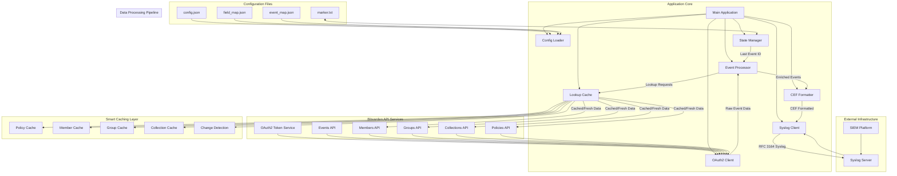
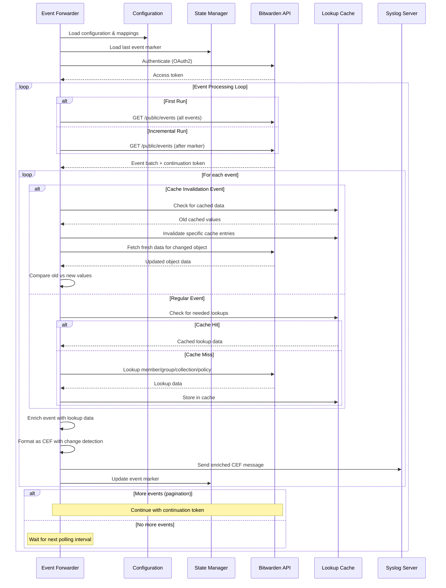
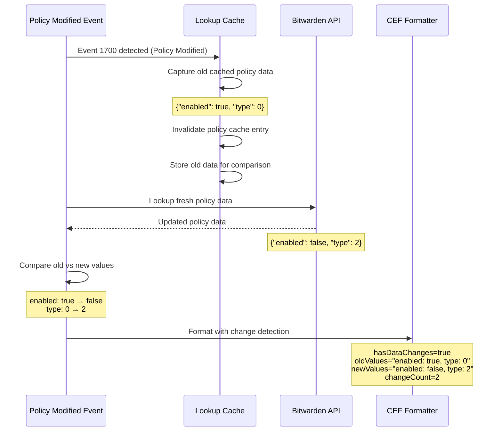

# Bitwarden Event Forwarder - A Bitwarden API to Syslog Forwarder

A standalone Go application that polls the Bitwarden Organization API for events and forwards them to a syslog server in CEF (Common Event Format) with intelligent enrichment, change detection, and comprehensive audit trails for SIEM ingestion and security monitoring.

## Overview

This application provides real-time event forwarding from Bitwarden Organizations to your SIEM or log analysis platform. It features intelligent caching with change detection, configurable field mappings, and converts all data to industry-standard CEF format with enhanced audit capabilities.

### Key Features

- **OAuth2 Authentication** - Secure client credentials flow for API access
- **Intelligent Caching** - Smart lookup caching with automatic invalidation
- **Change Detection** - Before/after value tracking for policy, member, group, and collection changes
- **CEF Format** - Industry-standard Common Event Format output with enrichment
- **Event-Driven Cache Management** - Real-time cache invalidation based on event types
- **Configurable Field Mappings** - External JSON configuration for flexible field mapping
- **Real-time Forwarding** - Configurable polling intervals with error recovery
- **Comprehensive Enrichment** - Automatic lookup of member names, group names, collection names, and policy details
- **State Management** - Prevents duplicate events with marker-based tracking
- **Connection Testing** - Pre-flight validation of all connections and configurations
- **Robust Error Handling** - Retry logic, circuit breakers, and graceful degradation

## Installation & Usage

### Prerequisites

- Go 1.18 or later
- Bitwarden Organization API credentials (Client ID and Secret)
- Network access to syslog server
- Appropriate Bitwarden API permissions (`api.organization` scope)

### Building

```bash
go build -o bw-events main.go
```

### Running

```bash
# Run with minimum required parameters
./bw-events --client-id "your-client-id" --client-secret "your-secret" --syslog-server "10.1.1.100"

# Run with configuration file
./bw-events --config /etc/bitwarden/config.json

# Test configuration and connections
./bw-events --test --client-id "your-client-id" --client-secret "your-secret"

# Validate configuration only
./bw-events --validate --config /etc/bitwarden/config.json

# Show help
./bw-events --help

# Show version information
./bw-events --version
```

## Command Line Arguments

| Argument | Description |
|----------|-------------|
| `--help` | Show comprehensive help message |
| `--version` | Show version and build information |
| `--validate` | Validate configuration and exit |
| `--test` | Test all connections and dependencies |
| `--config FILE` | Load configuration from JSON file |
| `--client-id ID` | Bitwarden API Client ID (required) |
| `--client-secret SECRET` | Bitwarden API Client Secret (required) |
| `--api-url URL` | Bitwarden API base URL (default: https://api.bitwarden.com) |
| `--identity-url URL` | Bitwarden Identity URL (default: https://identity.bitwarden.com) |
| `--syslog-server HOST` | Syslog server address (default: localhost) |
| `--syslog-port PORT` | Syslog server port (default: 514) |
| `--syslog-proto PROTO` | Syslog protocol: tcp/udp (default: tcp) |
| `--interval SECONDS` | Event fetch interval (default: 60) |
| `--conn-timeout SECONDS` | Connection timeout (default: 30) |
| `--log-level LEVEL` | Log level: debug/info/warn/error (default: info) |
| `--log-file FILE` | Log file path (default: stdout) |
| `--field-map FILE` | Field mapping configuration file |
| `--event-map FILE` | Event type mapping file |
| `--marker-file FILE` | Event marker file for state tracking |

## Configuration

### config.json Example Structure

```json
{
  "api_base_url": "https://api.bitwarden.com",
  "identity_url": "https://identity.bitwarden.com",
  "client_id": "your_client_id_from_bitwarden_portal",
  "client_secret": "your_client_secret_from_bitwarden_portal",
  "syslog_server": "your.syslog.server.com",
  "syslog_port": "514",
  "syslog_protocol": "tcp",
  "fetch_interval": 60,
  "log_level": "info",
  "log_file": "/var/log/bitwarden-events.log",
  "conn_timeout": 30,
  "max_msg_size": 8192,
  "marker_file": "/var/lib/bitwarden/marker.txt",
  "field_map_file": "/etc/bitwarden/field_map.json",
  "event_map_file": "/etc/bitwarden/event_map.json"
}
```

### Field Mapping Configuration (bitwarden_field_map.json)

```json
{
  "ordered_fields": [
    "rt", "cs1", "cs2", "suser", "email", "status", "2fa", "host_ip",
    "device", "groupId", "collectionId", "policyId", "actingUserId",
    "objectname", "hasDataChanges", "changeType", "oldValues", "newValues"
  ],
  "field_mappings": {
    "date": "rt",
    "type": "cs1",
    "id": "cs2",
    "memberId": "suser",
    "actingUserId": "actingUserId",
    "email": "email",
    "ipAddress": "host_ip",
    "device": "device"
  },
  "lookups": {
    "memberId": {
      "endpoint": "/public/members/{id}",
      "response_mapping": {
        "name": "memberName",
        "email": "memberEmail",
        "status": "memberStatus",
        "twoFactorEnabled": "member2FA"
      }
    },
    "groupId": {
      "endpoint": "/public/groups/{id}",
      "response_mapping": {
        "name": "groupName"
      }
    },
    "collectionId": {
      "endpoint": "/public/collections/{id}",
      "response_mapping": {
        "name": "collectionName"
      }
    },
    "policyId": {
      "endpoint": "/public/policies/{type}",
      "response_mapping": {
        "type": "policyType",
        "enabled": "policyEnabled",
        "policyTypeName": "policyTypeName"
      }
    }
  },
  "cache_invalidation_rules": {
    "1700": ["policyId"],
    "1500": ["memberId"], "1501": ["memberId"], "1502": ["memberId"],
    "1400": ["groupId"], "1401": ["groupId"], "1402": ["groupId"],
    "1300": ["collectionId"], "1301": ["collectionId"], "1302": ["collectionId"]
  },
  "cef_vendor": "Bitwarden",
  "cef_product": "Events",
  "cef_version": "1.0"
}
```

### Event Type Mapping (bitwarden_event_map.json)

```json
{
  "1000": "Logged In",
  "1001": "Changed account password",
  "1002": "Enabled/updated two-step login",
  "1100": "Created item",
  "1101": "Edited item",
  "1102": "Permanently Deleted item",
  "1300": "Created collection",
  "1301": "Edited collection",
  "1400": "Created group",
  "1500": "Invited user",
  "1600": "Edited organization settings",
  "1700": "Modified policy"
}
```

## Environment Variables

All configuration options can be set via environment variables with the `BW_` prefix:

| Environment Variable | Description |
|---------------------|-------------|
| `BW_API_URL` | Bitwarden API base URL |
| `BW_IDENTITY_URL` | Bitwarden Identity URL |
| `BW_CLIENT_ID` | API Client ID |
| `BW_CLIENT_SECRET` | API Client Secret |
| `SYSLOG_PROTOCOL` | Syslog protocol (tcp/udp) |
| `SYSLOG_SERVER` | Syslog server address |
| `SYSLOG_PORT` | Syslog server port |
| `FETCH_INTERVAL` | Event fetch interval in seconds |
| `LOG_LEVEL` | Log level |
| `LOG_FILE` | Log file path |
| `CONNECTION_TIMEOUT` | Connection timeout in seconds |
| `MARKER_FILE` | Event marker file path |
| `FIELD_MAP_FILE` | Field mapping configuration file |
| `EVENT_MAP_FILE` | Event type mapping file |
| `BW_CONFIG_FILE` | Configuration file path |

## State Management

### Marker File (bitwarden_marker.txt)

The application maintains state using a marker file to track the last processed event ID:

```
evt_01234567-89ab-cdef-0123-456789abcdef
```

### Collection Modes

#### Initial Collection (First Run)
- **Comprehensive**: Processes all available events from the beginning
- **No marker**: Starts without any event filtering
- **State initialization**: Records the last event ID for future incremental polling

#### Incremental Collection (Subsequent Runs)
- **Marker-based**: Only processes events after the last recorded marker
- **Efficient**: Minimizes API calls and processing
- **Continuation support**: Handles API pagination seamlessly

### Restarting from Scratch

To restart event collection from the beginning:

```bash
# Delete marker file to restart
rm /path/to/bitwarden_marker.txt

# Or use a fresh marker file location
./bw-events --marker-file /tmp/new_marker.txt
```

## Intelligent Caching & Change Detection

### Smart Cache Invalidation

The system automatically invalidates cached data when relevant events occur:

- **Event 1700** (Modified policy) → Invalidates policy cache
- **Events 1500-1516** (Member events) → Invalidates member cache  
- **Events 1400-1402** (Group events) → Invalidates group cache
- **Events 1300-1302** (Collection events) → Invalidates collection cache

### Change Detection Features

When objects are modified, the system captures before/after states:

```
# Example CEF output for policy change
hasDataChanges=true 
changeType=policyId 
changeCount=2 
changedFields=policyEnabled,policyType 
oldValues="enabled: true, type: 0" 
newValues="enabled: false, type: 2" 
policyEnabled_oldValue=true 
policyEnabled_newValue=false 
policyType_oldValue=0 
policyType_newValue=2
```

## Syslog Forwarding

### Message Format

Messages are sent in RFC 3164 syslog format with CEF payload:
```
<134>Jun 13 15:04:05 hostname BitwardenEvents: CEF:0|Bitwarden|Events|1.0|1500|Invited user|Medium|rt=2025-06-13T15:04:05.000Z cs1=1500 suser=user@company.com memberName=John Smith...
```

### CEF Structure

```
CEF:0|Bitwarden|Events|1.0|{EventType}|{EventName}|Medium|{Extensions}
```

- **Vendor**: Bitwarden
- **Product**: Events  
- **Version**: 1.0
- **Event Class ID**: Bitwarden event type (e.g., 1500)
- **Name**: Human-readable event name
- **Severity**: Always "Medium"
- **Extensions**: Enriched fields including member names, change detection, etc.

### Enhanced CEF Extensions

The system provides rich context in CEF extensions:
- **Basic fields**: Event ID, timestamp, user information
- **Enriched data**: Member names, group names, collection names, policy details
- **Change tracking**: Old/new values for modified objects
- **Audit context**: Acting user, IP address, device information

## API Integration

### Bitwarden Public API Endpoints

The forwarder integrates with multiple Bitwarden API endpoints:

- **Events**: `/public/events` - Primary event stream
- **Members**: `/public/members/{id}` - User information lookup
- **Groups**: `/public/groups/{id}` - Group information lookup  
- **Collections**: `/public/collections/{id}` - Collection information lookup
- **Policies**: `/public/policies` + `/public/policies/{type}` - Policy information lookup

### Pagination Handling

- **Continuation tokens**: Automatically handles API pagination
- **Efficient processing**: Processes events in batches
- **No data loss**: Ensures all events are captured across pagination boundaries

### Error Handling & Resilience

- **Token refresh**: Automatic OAuth2 token renewal before expiry
- **Retry logic**: Exponential backoff for transient errors
- **Circuit breaker**: Stops after consecutive failures to prevent infinite loops
- **Graceful degradation**: Continues processing even if individual lookups fail
- **Connection pooling**: Efficient connection reuse for API calls

## Architecture



## Operational Workflow



## Change Detection Workflow



## Monitoring & Troubleshooting

### Log Output

The application provides comprehensive logging with visual indicators:

```
🚀 Starting Bitwarden Event Forwarder v1.0.0
📋 Configuration loaded successfully
🔐 Authenticating with Bitwarden API...
✅ Successfully authenticated (expires: 2025-06-13 15:30:45)
💾 Cache initialized
🗺️  Field mappings loaded (4 lookups)
📝 Event types loaded (85 types)
🔍 Testing syslog connectivity...
✅ Syslog connectivity verified
🎯 Starting event polling...
📍 Reached marker evt_123, resuming
✅ Processed 15 events
```

### Connection Testing

Pre-flight testing validates all dependencies:

```bash
./bw-events --test
```

```
🔍 Testing configuration and connections...
  Testing Bitwarden API authentication... ✅ SUCCESS
  Testing Bitwarden API connectivity... ✅ SUCCESS
  Testing Syslog connectivity... ✅ SUCCESS
  Testing configuration files... ✅ SUCCESS
  Testing file permissions... ✅ SUCCESS
```

### Common Issues

1. **Authentication errors**: Verify client credentials and API permissions
2. **No events returned**: Check organization access and API connectivity
3. **Syslog connection failed**: Verify server address, port, and protocol  
4. **File permission errors**: Ensure proper access to marker and log files
5. **Cache lookup failures**: Check API endpoints and network connectivity

### Performance Considerations

- **Polling interval**: Balance real-time needs with API rate limits
- **Cache efficiency**: Lookup caching significantly reduces API calls
- **Change detection**: Minimal overhead, only active during actual changes
- **Network latency**: Consider network conditions for timeout settings
- **Log verbosity**: Adjust log level based on operational needs

## Security

- **Credentials**: Store API credentials securely, never in logs
- **Network**: Use TLS for API connections, secure syslog transport
- **Access control**: Limit file permissions on configuration and state files
- **Monitoring**: Monitor for authentication failures and suspicious activities
- **Audit trails**: Comprehensive logging for security event correlation

## API Permissions

Required Bitwarden API scopes:
- `api.organization` - Access to organization events and member information

## Performance Metrics

Typical performance characteristics:
- **API calls**: 1 base call + lookups per unique object per event
- **Cache efficiency**: 90%+ hit rate after warm-up period
- **Processing speed**: 100+ events per second (network dependent)
- **Memory usage**: <50MB typical, scales with cache size
- **Startup time**: <5 seconds including connection testing

## License

This project is provided as-is for educational and operational use. Ensure compliance with Bitwarden API terms of service and your organization's security policies.